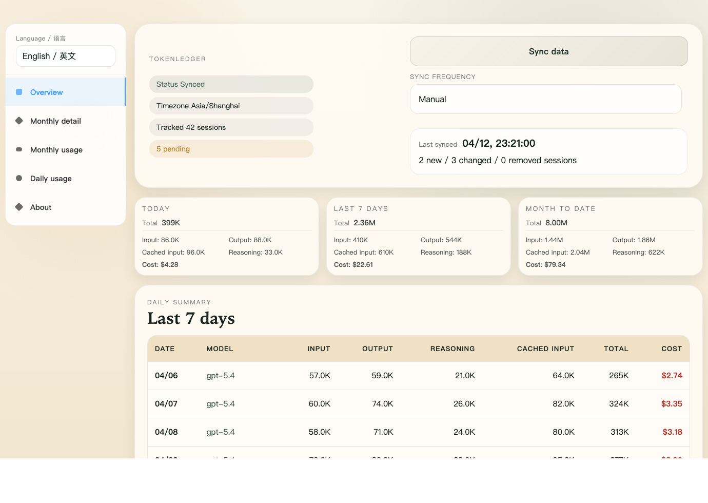
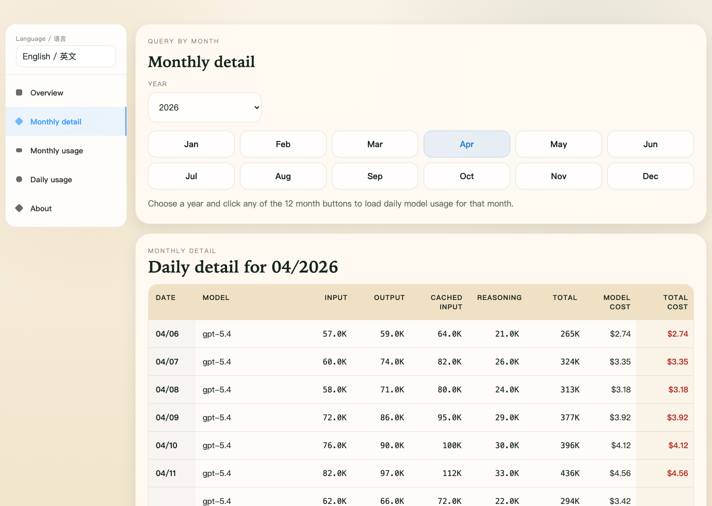
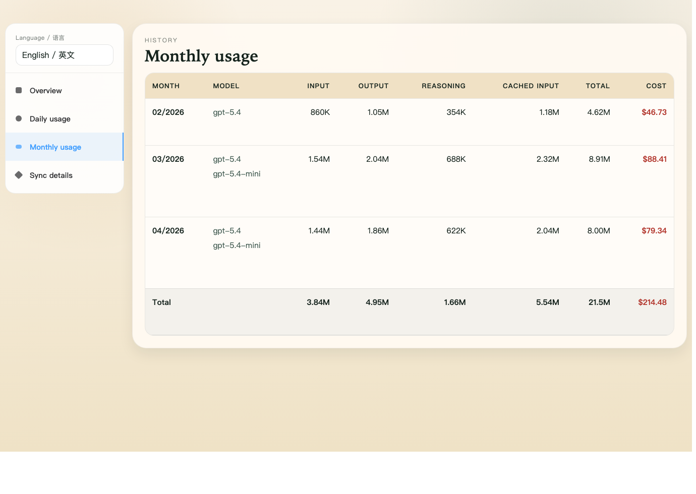

# TokenLedger

[中文说明](./README_CN.md)

`TokenLedger` is a Tauri desktop dashboard for reading Codex session data, syncing aggregated results into a local SQLite database, and browsing token and cost trends across today, the last 7 days, month-to-date, daily, and monthly views.

## Screenshots

The screenshots below were generated with the browser `?demo=1` demo mode so no local data is stored in the repository.

### Overview



### Monthly Detail



### Monthly Usage



## Features

- Reads Codex session data from `CODEX_HOME/sessions/*.jsonl`
- Writes aggregated usage into `CODEX_HOME/.codex-usage/usage.sqlite`
- Includes Overview, Daily usage, Monthly usage, and About views
- Supports auto-sync interval changes and SQLite path overrides
- Checks GitHub Releases for new versions and can install app updates in place
- Includes built-in English and Chinese UI switching

## Requirements

- Node.js `>= 25`
- Stable Rust toolchain, `cargo`, and `rustc`
- `xcodebuild` on macOS when packaging the app

## Quick Start

### Run the desktop app

```bash
npm ci
npm run desktop -- dev
```

### Preview the frontend only

```bash
npm run dev -- --host 127.0.0.1
```

Open `http://127.0.0.1:5173/?demo=1` to preview the UI with demo data.  
You can also open a specific view directly with `tab`:

- `?demo=1&tab=overview`
- `?demo=1&tab=monthlyHistory`
- `?demo=1&tab=monthlyDetail`
- `?demo=1&tab=dailyDetail`


### Checks and tests

```bash
npm run typecheck
cd src-tauri && cargo test
```

### Package the desktop app

```bash
npm run package:app
```

Packaged runnable artifacts are copied into `release-app/` by default. See [docs/howto/package-desktop-app.md](./docs/howto/package-desktop-app.md) for details.

## Data Paths

- Default Codex directory
  - macOS / Linux: `~/.codex`
  - Windows: `%USERPROFILE%\\.codex`
- Default SQLite path: `CODEX_HOME/.codex-usage/usage.sqlite`
- If `CODEX_USAGE_DATABASE` is set, the app uses that path first

## Project Structure

```text
src/             Frontend UI, i18n, DTOs, and Tauri API bridge
src-tauri/       Rust backend, commands, SQLite, and Tauri config
docs/howto/      User and packaging guides
scripts/         Packaging and comparison helpers
release-app/     Output directory for packaged apps
```

## Related Docs

- [docs/index.md](./docs/index.md)
- [docs/howto/use-desktop-dashboard.md](./docs/howto/use-desktop-dashboard.md)
- [docs/howto/package-desktop-app.md](./docs/howto/package-desktop-app.md)
- [docs/howto/auto-update.md](./docs/howto/auto-update.md)
