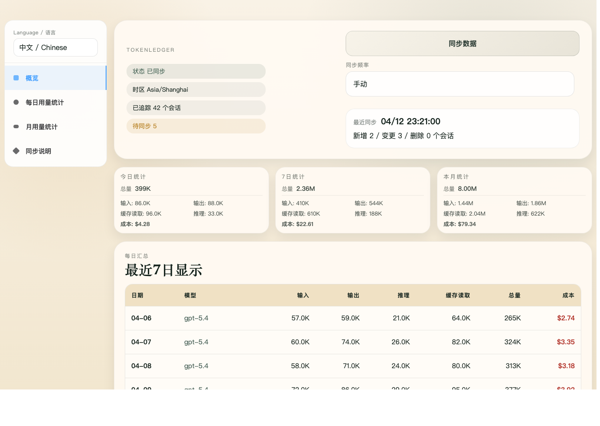
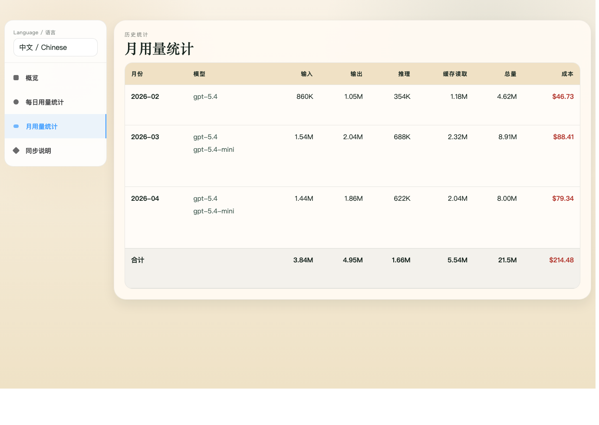

# TokenLedger

[English README](./README.md)

`TokenLedger` 是一个基于 Tauri 的桌面看板，用来读取 Codex 会话数据，把统计结果同步到本地 SQLite，并按今日、近 7 日、本月、每日和每月维度查看 token 与成本变化。

## 截图

### Overview



### Monthly Usage




## 功能

- 从 `CODEX_HOME/sessions/*.jsonl` 读取 Codex 会话数据
- 将聚合结果写入 `CODEX_HOME/.codex-usage/usage.sqlite`
- 提供概览、每日用量、每月用量、同步说明 4 个视图
- 支持自动同步频率切换和 SQLite 路径覆盖
- 内置中英文界面切换

## 环境要求

- Node.js `>= 25`
- Rust stable、`cargo`、`rustc`
- macOS 打包时需要 `xcodebuild`

## 快速开始

### 运行桌面版

```bash
npm ci
npm run desktop -- dev
```


### 检查与测试

```bash
npm run typecheck
cd src-tauri && cargo test
```

### 打包桌面应用

```bash
npm run package:app
```

打包后的可运行产物默认会复制到 `release-app/`。详细说明见 [docs/howto/package-desktop-app.md](./docs/howto/package-desktop-app.md)。

## 数据路径

- 默认 Codex 目录
  - macOS / Linux: `~/.codex`
  - Windows: `%USERPROFILE%\\.codex`
- 默认 SQLite 路径: `CODEX_HOME/.codex-usage/usage.sqlite`
- 如果设置了 `CODEX_USAGE_DATABASE`，应用会优先使用该路径

## 项目结构

```text
src/             Frontend UI、i18n、DTO、Tauri API bridge
src-tauri/       Rust backend、命令、SQLite、Tauri 配置
docs/howto/      使用与打包说明
scripts/         打包与对比辅助脚本
release-app/     打包后的输出目录
```

## 相关文档

- [docs/index.md](./docs/index.md)
- [docs/howto/use-desktop-dashboard.md](./docs/howto/use-desktop-dashboard.md)
- [docs/howto/package-desktop-app.md](./docs/howto/package-desktop-app.md)
