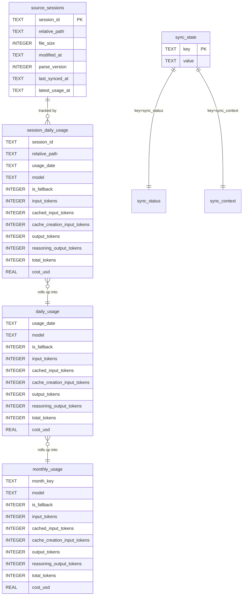

# Data Model

TokenLedger keeps two layers of state:

- **Read-only source** — Codex session files at `${CODEX_HOME}/sessions/*.jsonl`.
  These are never written by TokenLedger.
- **Derived aggregates** — a SQLite database (default
  `${CODEX_HOME}/.codex-usage/usage.sqlite`) that is migrated on open by
  `UsageStore::migrate` (`src-tauri/src/store.rs`).

The schema uses two aggregate tables: `session_daily_usage` (per session +
date + model) and `daily_usage` / `monthly_usage` (cross-session rollups).
Sync rebuilds only the affected date keys, so a single changed session
typically rewrites one day's worth of rollups.



Primary keys:

- `source_sessions`: `session_id`
- `session_daily_usage`: `(session_id, usage_date, model, is_fallback)`
- `daily_usage`: `(usage_date, model, is_fallback)`
- `monthly_usage`: `(month_key, model, is_fallback)`
- `sync_state`: `key` (used as a small key/value bag: `sync_status`, `sync_context`)

`PRAGMA journal_mode = WAL` and `PRAGMA synchronous = NORMAL` are set on every
open, which is why the on-disk file is safe to read while syncs are in
flight. Writes that mutate multiple tables (`replace_session_file`,
`delete_sessions`, `rebuild_aggregates_for_date_keys`) all run inside a
`BEGIN IMMEDIATE` transaction in `UsageStore::with_transaction`.

## sync_state key/value rows

`UsageStore` stores two JSON-encoded rows under `sync_state`:

- `sync_status` → `SyncStatus` (`state`, `last_synced_at`, `error_message`,
  `coverage_through`, `coverage_granularity`, `scanned_files`,
  `session_count`, `data_source`).
- `sync_context` → `SyncContext` (`codex_home_path`, `time_zone`,
  `parse_version`). Used by `UsageRepository::requires_full_rescan` to detect
  migrations and timezone changes.

Both rows are upserted via `INSERT … ON CONFLICT(key) DO UPDATE SET value =
excluded.value`. If parsing fails, the loader falls back to an idle /
empty value, so the app never crashes on a stale JSON row.

## What goes into each rollup

`sync_with_progress_from_entries` walks dirty entries in this order:

1. `parser::parse_session_file` returns `ParsedSessionFile` with one row
   per `(date_key, model, is_fallback)` (`DailySessionModelUsage`).
2. `UsageStore::replace_session_file` deletes any existing
   `session_daily_usage` rows for that `session_id`, inserts the new ones,
   and upserts the matching `source_sessions` row.
3. After all dirty files are processed, `delete_sessions` removes any
   session_ids that disappeared from disk.
4. `UsageStore::rebuild_aggregates_for_date_keys` recomputes daily and
   monthly rollups by issuing
   `INSERT INTO daily_usage SELECT … FROM session_daily_usage … GROUP BY …`
   for each affected date. This is the only place that mutates `daily_usage`
   and `monthly_usage`.

`force_full_rescan` adds `UsageStore::reset_cache` (clears the four
content tables) and treats every existing file as dirty.

## Date keys and time zones

`src-tauri/src/date_keys.rs` produces and manipulates `YYYY-MM-DD` strings
that are always evaluated in the configured IANA timezone. `date_key_for`
calls `chrono_tz::Tz::parse` on the configured zone and formats the UTC
instant with that zone's local date. Helpers:

- `last_n_date_keys(now, tz, count)` — last `count` dates ending today.
- `add_days_to_date_key(date_key, delta_days)` — arithmetic on
  `NaiveDate`, used for period bounds and weekly activity walls.
- `month_key_for(now, tz)` — `YYYY-MM`.

`AppState::detect()` chooses the time zone in this order: `TZ` env var
(non-empty), `iana_time_zone::get_timezone`, `"UTC"`. Changing the time
zone after a sync triggers a full rescan because `SyncContext.time_zone`
will no longer match.

## App settings on disk

The settings file is intentionally separate from the SQLite cache so it
survives database resets and never bloats the schema:

- Default path: `${CODEX_HOME}/.tokenledger/settings.json`
- Legacy fallbacks (read once on first launch): `${CODEX_HOME}/.tokenaccount/settings.json`,
  `${CODEX_HOME}/.codex-usage-tauri/settings.json`
- Schema: `{ "databasePath": "..." | null, "modelPricingOverrides": [...] }` (see
  `AppSettings` in `src-tauri/src/app_state.rs`).

`set_database_path` writes the path and marks it as `DatabasePathSource::Config`;
`reset_database_path` clears the stored value and falls back to the default
under `DatabasePathSource::Default`. `set_model_pricing_overrides` validates
the supplied list, persists the validated form, and re-prices historical
aggregates on the next dashboard read. Stored overrides that fail
validation are dropped back to the disabled preset by
`normalize_pricing_overrides` so the app never crashes on a stale
`settings.json`.

## JSONL source shape

The parser only acts on lines whose top-level `type` is `turn_context`
(model hint) or `event_msg` with `payload.type == "token_count"`. The
full schema walkthrough lives in [workflows/sync.md](../workflows/sync.md).

## Pricing table

`src-tauri/src/pricing.rs` is the single source of truth for cost. It
normalizes model names by stripping prefixes (`openrouter/openai/`,
`openai/`, `azure/`) and trailing dated snapshots (e.g.
`gpt-5.5-2026-04-24` → `gpt-5.5`), then looks up rates per million tokens.
`gpt-5.6` is treated as an alias of `gpt-5.6-sol` for pricing lookup so the
generic model name and the explicit relay variant resolve to the same
rates. Each rate entry is a `ModelPricingRates` with **four** fields —
input, output, cache read, and cache creation — and the model math
subtracts the cached and cache-creation buckets from the total input
before charging the regular input rate:

```
regular_input = max(input_tokens − cache_read − cache_creation, 0)
cache_read   = clamp(cached_input_tokens, 0, input_tokens)
cache_creation = clamp(cache_creation_input_tokens, 0, input_tokens − cache_read)
```

| Model | Input $/M | Cache read $/M | Cache creation $/M | Output $/M | Source |
|---|---|---|---|---|---|
| `gpt-5.6`, `gpt-5.6-sol` | 5.00 | 0.50 | 5.00 | 30.00 | OpenAI API |
| `gpt-5.6-terra` | 2.50 | 0.25 | 2.50 | 15.00 | OpenAI API |
| `gpt-5.6-luna` | 1.00 | 0.10 | 1.00 | 6.00 | OpenAI API |
| `gpt-5.5` | 5.00 | 0.50 | 5.00 | 30.00 | Codex rate card |
| `gpt-5.4` | 2.50 | 0.25 | 2.50 | 15.00 | Codex rate card |
| `gpt-5.4-mini` | 0.75 | 0.075 | 0.75 | 4.52 | Codex rate card |
| `gpt-5.3-codex` | 1.75 | 0.175 | 1.75 | 14.00 | Codex rate card |
| `gpt-5.3-codex-spark` | 1.75 | 0.175 | 1.75 | 14.00 | Estimated (rate card pending) |

`cost_for(usage, model)` clamps each cache category to the remaining
input budget and returns `0.0` when the model has no rate. The raw notes
are surfaced through `DashboardMeta.pricing_notes` (see `pricing_notes()`
and `src/api/demo.ts::DEMO_META.pricingNotes`).

### Relay-model pricing overrides

The three relay models (`gpt-5.6-sol`, `gpt-5.6-terra`, `gpt-5.6-luna`) can
be billed at user-supplied rates instead of the official OpenAI rates, so
operators running a private relay can record what they actually pay.
Overrides are stored on disk in `AppSettings.model_pricing_overrides`
(validated by `validate_pricing_overrides`, which requires **all three**
models to be present and forbids negative / non-finite rates) and surfaced
to the renderer via `DashboardMeta.model_pricing_settings`, which pairs
each model's `officialRates` and `relayRates` with a `relayEnabled`
boolean. The frontend form (see
[workflows/dashboard-views.md → Model pricing](../workflows/dashboard-views.md#model-pricing-set_model_pricing_settings))
lets the user toggle the boolean, edit any of the four relay rate fields,
and persist the result through the `set_model_pricing_settings` Tauri
command.

The current relay preset (the values restored by "Restore relay preset" in
the UI) is:

| Model | Input $/M | Cache read $/M | Cache creation $/M | Output $/M |
|---|---|---|---|---|
| `gpt-5.6-sol` | 9.00 | 0.90 | 11.25 | 54.00 |
| `gpt-5.6-terra` | 4.50 | 0.45 | 5.40 | 27.00 |
| `gpt-5.6-luna` | 1.80 | 0.18 | 2.25 | 10.80 |

When `relayEnabled` is true for a model, `cost_for_with_overrides` uses the
relay rates for that model only; every other model still falls back to
`official_pricing_for`. The repository re-prices parsed files, daily
rows, and monthly rows against the override list on every dashboard
build, so editing the relay rates in the UI immediately changes the
historical totals without a rescan. Tests in `pricing.rs` lock the
default, the override, the generic-name alias, the input-budget clamping,
and the validation paths.

## Where each piece lives

- **JSONL on disk** — the source of truth; never modified by the app.
- **`source_sessions`** — last-known file metadata; drives dirty detection.
- **`session_daily_usage`** — per `(session, date, model)` totals; rebuilt
  whenever the source file changes.
- **`daily_usage`** / **`monthly_usage`** — derived rollups; rebuilt only for
  affected date keys to keep sync fast.
- **`sync_state`** — last-known `SyncStatus` and `SyncContext`; surfaced to
  the UI on every dashboard fetch.

See [workflows/sync.md](../workflows/sync.md) for the lifecycle that
produces and consumes these tables, and
[source-map.md](../source-map.md) for the module-level layout.