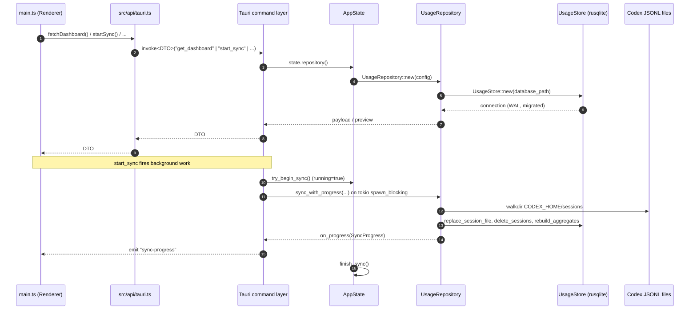

# Runtime Architecture

TokenLedger has two halves that communicate through Tauri commands and one
event channel:

- **Frontend** — Vite + TypeScript in `src/`. No UI framework; `src/main.ts`
  (~93k bytes) renders into `#root` directly with template strings and
  cached `Intl.NumberFormat` / `Intl.DateTimeFormat` instances.
- **Backend** — Rust + Tauri in `src-tauri/src/`. Thirteen `#[tauri::command]`
  functions registered in `src-tauri/src/main.rs` are the only public API
  to the frontend. The thirteenth is `set_model_pricing_settings`, which
  lets the user override pricing for the three relay models — see
  [data-model.md](data-model.md#relay-model-pricing-overrides).

A single `AppState` instance is shared across commands; it owns the SQLite
connection (via `UsageRepository` → `UsageStore`), a sync execution guard,
short-lived preview caches, and the on-disk settings path.



## Frontend entry points

| File | Purpose |
|---|---|
| `index.html` | Single `#root` div, mounts `src/main.ts` |
| `src/main.ts` | All UI rendering, tab state, sync loop, updater UX |
| `src/i18n.ts` | `MESSAGES["zh-CN" \| "en-US"]`, locale persistence |
| `src/dto/dashboard.ts` | TypeScript mirror of the Rust DTOs in `src-tauri/src/models.rs` |
| `src/api/tauri.ts` | `invoke<T>("...")` wrappers + demo-mode fallbacks |
| `src/api/updater.ts` | `check`, `downloadAndInstall`, `relaunch` |
| `src/api/demo.ts` | In-memory `DashboardPayloadDTO` used when `?demo=1` is set |
| `src/styles.css` | All styles, including light/dark theme via `[data-theme]` |

The frontend is intentionally framework-free. `src/main.ts` holds tab state,
form drafts, sync loop timers, and the entire render tree; helpers cache
`Intl` formatters per locale to avoid re-instantiation.

## Backend modules

`src-tauri/src/lib.rs` re-exports the public modules; `src-tauri/src/main.rs`
is the binary entry that wires plugins and the command list.

| File | Role |
|---|---|
| `commands.rs` | Thirteen `#[tauri::command]` functions. Validates inputs and bridges to `AppState`. The pricing one accepts a `Vec<ModelPricingOverride>` and returns the rebuilt `DashboardPayloadDTO`. |
| `app_state.rs` | Owns `codex_home_path`, settings path, current SQLite path + source, model-pricing overrides, sync state, sync preview cache, session file scan cache. |
| `models.rs` | All serde-serialized DTOs that cross the Tauri boundary, plus helper functions (`empty_usage_totals`, `add_usage_totals`, `sort_breakdowns`, …). |
| `parser.rs` | Streaming parser for one `*.jsonl` session file: extracts model from `turn_context`, computes per-event token deltas, looks up cost via `pricing.rs`. |
| `repository.rs` | Orchestrates scan → dirty detection → parse → DB write → aggregate rebuild. Houses the `SyncProgress` lifecycle. |
| `store.rs` | Thin wrapper over `rusqlite::Connection` with `migrate`, `replace_session_file`, `delete_sessions`, `rebuild_aggregates_for_date_keys`, `list_daily_rows_between`, `list_monthly_rows`. |
| `pricing.rs` | `normalize_model`, `cost_for`, `cost_for_with_overrides`, `default_model_pricing_overrides`, `validate_pricing_overrides`, `normalize_pricing_overrides`, `model_pricing_settings`, `pricing_notes`. Hard-coded per-model rates plus the relay-model override surface. |
| `date_keys.rs` | TZ-aware `date_key_for`, `last_n_date_keys`, `month_key_for`, `add_days_to_date_key`, `parse_timestamp`. |
| `bin/export_dashboard.rs` | CLI helper that prints `DashboardPayloadDTO` as JSON for the `compare-ts-rust` script. |

## Plugin and capability surface

`src-tauri/capabilities/default.json` whitelists exactly the commands the
window can invoke and grants `process:default` + `updater:default`:

```
core:default
core:window:allow-show
allow-ping | allow-get-dashboard | allow-get-sync-preview | allow-start-sync
allow-is-sync-running | allow-get-sync-status | allow-get-sync-progress
allow-get-app-meta | allow-open-source-repository | allow-query-daily-usage
allow-set-database-path | allow-reset-database-path
allow-set-model-pricing-settings
process:default
updater:default
```

Adding a new command means adding it in three places: `commands.rs`, the
`invoke_handler!` list in `src-tauri/src/main.rs`, and a matching
`allow-<command>` entry here. The Tauri window also starts hidden
(`"visible": false` in `src-tauri/tauri.conf.json`) and is shown after the
first render (see commit `4c57f56 fix(startup): hide window on launch and show
after first render`).

## Sync execution guard

`AppState` enforces single-flight syncs:

- `try_begin_sync` flips `running = true` and stores a fresh
  `SyncProgress { phase: Preparing, … }`. A second call returns `false`
  without doing work.
- `lock_available_operation` is the shared guard used by
  `set_database_path`, `reset_database_path`, and
  `set_model_pricing_overrides` to refuse concurrent changes while a sync
  is running.
- `finish_sync` resets `running`, drops `progress`, and invalidates the
  sync preview cache and the session file scan cache.

## Configuration sources

`AppState::detect()` resolves configuration in this priority order:

1. `CODEX_USAGE_DATABASE` (env) → `DatabasePathSource::Env`, locks the path
2. `CODEX_HOME/.tokenledger/settings.json` → `DatabasePathSource::Config`
3. Fallback: legacy `.tokenaccount/settings.json` or `.codex-usage-tauri/settings.json`
4. `default_database_path` = `CODEX_HOME/.codex-usage/usage.sqlite`

`CODEX_HOME` resolution: env var first, then `~/.codex` (or `%USERPROFILE%\.codex`),
then `.codex` (relative). Time-zone comes from `TZ` env, else
`iana_time_zone::get_timezone`, else `"UTC"`.

See [architecture/data-model.md](data-model.md) for the schema and
[workflows/sync.md](../workflows/sync.md) for the full sync lifecycle.