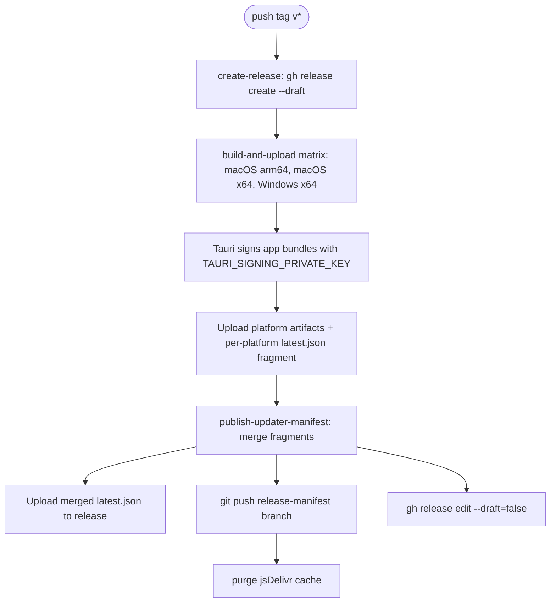

# Releases & Packaging

TokenLedger ships desktop bundles for macOS (arm64 and x64) and Windows
(x64). There is no Linux target today; the `--all` targets Tauri would
otherwise pick up are deliberately scoped via the matrix below.

## Bumping the version

Three files must move in lockstep:

```
package.json                     → "version": "0.4.4"
src-tauri/Cargo.toml             → version = "0.4.4"
src-tauri/tauri.conf.json        → "version": "0.4.4"
src-tauri/tauri.release.conf.json→ (release-only config; usually untouched)
```

`src-tauri/Cargo.lock` is regenerated by the next `cargo` invocation;
review the diff and commit it as part of the bump. The `AGENTS.md` note
explicitly calls this out.

After bumping, push a tag of the form `v0.4.4`. The release workflow
listens on `tags: [v*]` and is the single source of truth for
distribution.

## Local packaging (`npm run package:app`)

`scripts/package-app.sh` is a thin wrapper over `tauri build`:

1. `require_command` for `node`, `npm`, `cargo`, `rustc`, and on macOS
   `xcodebuild`.
2. Runs `npm install` if `node_modules/` is missing (skippable with
   `--skip-install`).
3. Runs `npm run typecheck` (skippable with `--skip-typecheck`).
4. If `local/tauri-updater.key` exists and no signing env vars are set,
   loads the key into `TAURI_SIGNING_PRIVATE_KEY`.
5. Calls `node_modules/.bin/tauri build --bundles app` (macOS only —
   the script fails on other uname values).
6. Copies the bundled `.app` from
   `src-tauri/target/release/bundle/macos/${productName}.app` to
   `${OUT_DIR}/${productName}.app` (default `release-app/`).
7. With `--open`, runs `open -R` on the artifact to reveal it in
   Finder.

Common flags:

```
scripts/package-app.sh --skip-install
scripts/package-app.sh --skip-typecheck
scripts/package-app.sh --out-dir dist/TokenLedger.app
scripts/package-app.sh --open
scripts/package-app.sh --help
```

The script warns if `CODEX_HOME` or `CODEX_USAGE_DATABASE` is set when
the script is run from a shell — those variables do not propagate when
the resulting `.app` is launched from Finder, so packaged binaries
fall back to defaults.

## Tauri configuration

`src-tauri/tauri.conf.json` is the primary config:

- `productName: "TokenLedger"` (used for the `.app` filename and the
  updater manifest).
- `identifier: "me.ionet.tokenledger"` (used by updater signature checks
  and macOS bundle id).
- `windows[0].visible: false` — the renderer flips this to `true` after
  first render via `core:window:allow-show` (see
  [architecture/overview.md](../architecture/overview.md) and the commit
  history note in `AGENTS.md`).
- `bundle.targets: "all"` — for local packaging we override this through
  `--bundles app`.
- `bundle.macOS.minimumSystemVersion: "12.0"`.

`src-tauri/tauri.release.conf.json` is the release-only override used
by CI (currently a stub). Local builds use the primary config.

## GitHub Actions

Three workflows under `.github/workflows/`:

### `desktop-ci.yml`

Runs on `pull_request`, `push` to `main`, and `workflow_dispatch`.

- Matrix: macOS-latest (label "macOS"), windows-latest (label "Windows").
- Steps: checkout, Node 25 setup, Rust stable setup, `swatinem/rust-cache`,
  `npm ci`, `npm run typecheck`, `cargo test`, `npm run desktop -- build --ci --no-sign`,
  upload bundles as artifacts (14 days).
- The bundle artifacts use the platform artifact name
  `desktop-bundle-${label}`.

### `release.yml`

Triggered by `tags: [v*]`. Concurrency is
`${{ github.workflow }}-${{ github.ref }}` with `cancel-in-progress: false`
so a tag push cannot be aborted by a later push.



**Job 1 — `create-release`** runs on Ubuntu and creates the GitHub Release
as a **draft** so that `publish-updater-manifest` can finish uploading
`latest.json` before the release becomes public. Commit `b5ac7fe ci(release):
create release as draft to prevent updater 404s` exists specifically for
this — without the draft, end users would see 404s on `latest.json` while
assets were still uploading.

**Job 2 — `build-and-upload`** matrix:

| OS | Label | Asset suffix | Updater target | Rust target |
|---|---|---|---|---|
| `macos-latest` | macOS arm64 | `macos-arm64` | `darwin-aarch64` | `aarch64-apple-darwin` |
| `macos-latest` | macOS x64 | `macos-x64` | `darwin-x86_64` | `x86_64-apple-darwin` |
| `windows-latest` | Windows x64 | `windows-x64` | `windows-x86_64` | (host default) |

For each matrix entry the workflow:

1. Runs `npm ci`, `npm run typecheck`, `cargo test`.
2. Builds with
   `npm run desktop -- build --ci --config src-tauri/tauri.release.conf.json [targets]`.
3. Picks the right artifact type per OS:
   - macOS: `dmg/*.dmg` + `macos/*.app.tar.gz` (+ `.sig`).
   - Windows: `msi/*.msi`, `nsis/*.exe`, `nsis/*.zip` (and their `.sig`).
4. Renames each artifact to
   `${safe_app_name}-${TAG_NAME}-${asset_suffix}.${ext}` and uploads via
   `gh release upload --clobber`.
5. Writes the per-platform fragment file to
   `$RUNNER_TEMP/updater-fragment/${UPDATER_TARGET}.json`.

**Job 3 — `publish-updater-manifest`** downloads all `updater-fragment-*`
artifacts, reads release notes + `publishedAt` from the draft, calls
`node scripts/build-updater-manifest.mjs` to merge fragments into the
final `latest.json`, uploads it to the GitHub release, force-pushes
`latest.json` to the `release-manifest` branch, purges jsDelivr's cache,
and finally marks the release as published (`--draft=false`).

### `openwiki-update.yml`

Scheduled (`0 8 * * *`) and `workflow_dispatch`. Runs `openwiki code --update --print`
and opens a PR via `peter-evans/create-pull-request@v7` against the
`openwiki/update` branch. The PR touches `openwiki/`, `AGENTS.md`,
`CLAUDE.md`, and the workflow file itself.

## macOS signing and notarization

`AGENTS.md` warns:

> macOS packaged builds are not yet signed with an Apple Developer ID
> certificate or notarized by Apple. Update checks can still work in
> packaged builds, but replacement apps may be blocked by Gatekeeper on
> first launch. For local testing, prefer the GitHub Release install
> package over a manually copied `.app`, and expect quarantine removal to
> be necessary in some cases.

The same warning surfaces in the app's localized strings
(`updateMacUnsignedHint`, `updateMacUnsignedErrorHint`). When Apple
signing is added, it will require:

- A Developer ID Application certificate exported as a `.p12` with a
  passphrase stored in a GitHub Actions secret.
- The notarytool flow (`xcrun notarytool submit … --wait`) followed by
  `xcrun stapler staple`.
- Updating `bundle.macOS.entitlements` and `bundle.macOS.providerShortName`.

Until then, releases still produce working `.dmg` and `.app.tar.gz`
artifacts that the updater plugin will install, but end users will see a
Gatekeeper dialog on first launch.

## CI secrets

The release workflow uses:

| Secret | Used by | Purpose |
|---|---|---|
| `GITHUB_TOKEN` | all jobs | Authenticates `gh release create/upload` and `git push`. |
| `TAURI_SIGNING_PRIVATE_KEY` | build job | Minisign private key for app signing. |
| `TAURI_SIGNING_PRIVATE_KEY_PASSWORD` | build job | Passphrase for that key. |
| `OPENROUTER_API_KEY` | openwiki-update job | LLM provider for the OpenWiki run. |
| `LANGSMITH_API_KEY` | openwiki-update job | Tracing. |

None of these belong in the repo or in the wiki. Reference them only by
secret name.

## In-app updater

`tauri-plugin-updater` is wired up in `src-tauri/src/main.rs` and configured
in `src-tauri/tauri.conf.json`:

```json
"plugins": {
  "updater": {
    "pubkey": "...",
    "endpoints": [
      "https://cdn.jsdelivr.net/gh/iohao/token-ledger@release-manifest/latest.json",
      "https://github.com/iohao/token-ledger/releases/latest/download/latest.json",
      "https://gh-proxy.com/https://github.com/iohao/token-ledger/releases/latest/download/latest.json"
    ],
    "windows": { "installMode": "passive" }
  }
}
```

The plugin walks the endpoints in order, prefers the first one that
returns a `latest.json` whose signature verifies against `pubkey`, and
then downloads the platform-specific bundle referenced in `platforms`.

### Frontend flow

`src/api/updater.ts` exposes three functions, each gated on `isDemoMode()`:

- `fetchCurrentAppVersion()` — `getVersion()` from `@tauri-apps/api/app`.
- `checkForPendingAppUpdate()` — `check()` from
  `@tauri-apps/plugin-updater`. Returns `null` in demo mode.
- `installPendingAppUpdate(update, onProgress)` —
  `update.downloadAndInstall(...)` translating the three Tauri events
  (`Started`, `Progress`, `Finished`) into a flat
  `AppUpdateProgressEvent` discriminated union, then `relaunch()` from
  `@tauri-apps/plugin-process`.

`src/main.ts` wires the updater UX into the "About" tab (`?tab=syncInfo`):

- On launch, `tryInitialAppUpdateCheck` calls `check()` silently and
  remembers the result.
- The user can click "Check for updates" to re-check.
- A successful check sets `updateStatus = "available"` and surfaces a
  banner with `Download and install`. Pressing it calls
  `installPendingAppUpdate`, which downloads, installs, and relaunches.

macOS-specific copy (in `src/i18n.ts`) reminds users that the bundled
app is **not** signed or notarized (`updateMacUnsignedHint`,
`updateMacUnsignedErrorHint`). See the macOS section above for the
unblock-the-user instructions that ship with the app.

### What `latest.json` looks like

`scripts/build-updater-manifest.mjs` (run by the release workflow) merges
per-platform fragment files into a single manifest:

```json
{
  "version": "0.4.4",
  "notes": "…release notes…",
  "pub_date": "2026-04-12T15:21:00Z",
  "platforms": {
    "darwin-aarch64":   { "url": "…", "signature": "…" },
    "darwin-x86_64":    { "url": "…", "signature": "…" },
    "windows-x86_64":   { "url": "…", "signature": "…" }
  }
}
```

Each `platforms.<key>` entry is generated by the `build-and-upload` job.
The fragment shape (per platform):

```json
{
  "platform": "darwin-aarch64",
  "url": "https://github.com/iohao/token-ledger/releases/download/v0.4.4/TokenLedger-v0.4.4-macos-arm64.app.tar.gz",
  "signature": "<base64 minisign signature>"
}
```

### Local signing key

`scripts/package-app.sh` looks for `local/tauri-updater.key` and exports
its contents as `TAURI_SIGNING_PRIVATE_KEY` if neither that env var nor
`TAURI_SIGNING_PRIVATE_KEY_PATH` is already set. The key file itself is
gitignored (see `.gitignore`: `local/`); never commit it. The matching
public key is committed in `src-tauri/tauri.conf.json` (`pubkey`) and is
the only thing the client uses to verify signatures.

### Adding a new platform

1. Add a matrix row in `.github/workflows/release.yml`.
2. Add a matching `asset_suffix`, `updater_target`, `bundle_root`,
   `tauri_args`, `rust_targets` line.
3. Extend the `release_files` glob and `updater_files` selection if the
   platform produces a different bundle type.
4. Re-run `scripts/build-updater-manifest.mjs` to confirm the new key is
   included.
5. Update the updater's hard-coded endpoint list if the platform needs a
   separate channel.

## Release flow diagram


The release is created as a **draft** (`create-release` job) so that
`publish-updater-manifest` can finish uploading `latest.json` before the
release becomes public. Commit `b5ac7fe ci(release): create release as
draft to prevent updater 404s` records the motivation: without the draft,
end users would see 404s on `latest.json` while assets were still
uploading.