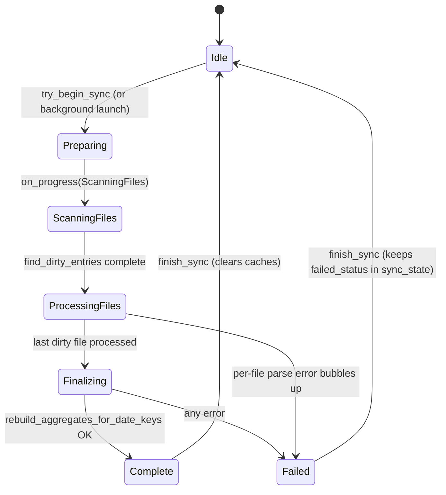
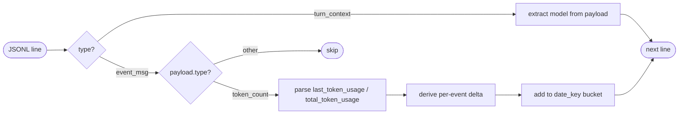

# Sync Lifecycle

`UsageRepository::sync_with_progress_from_entries`
(`src-tauri/src/repository.rs`) is the only producer of `SyncStatus`. It is
called from `commands::start_sync` (background, via `tauri::async_runtime::spawn_blocking`)
and from the CLI binary `bin/export_dashboard.rs` (foreground, with
`--run-sync`). The Tauri command publishes each `SyncProgress` to two sinks:

- `AppState::update_sync_progress` — kept in memory so the frontend can
  poll it with `get_sync_progress`.
- `app_handle.emit("sync-progress", &progress)` — the streaming channel
  consumed by the renderer.



## Phases and what each one touches

| Phase | What happens | Source |
|---|---|---|
| `Preparing` | Initial `SyncProgress` written before any work. | `repository.rs` `SyncProgress { phase: Preparing, … }` |
| `ScanningFiles` | `walkdir` on `${CODEX_HOME}/sessions`, returns `Vec<SessionFileEntry>`. | `repository::scan_session_files` |
| `ProcessingFiles` | Dirty entries parsed one by one; `replace_session_file` writes per-session rows and upserts `source_sessions`. | `repository::perform_sync` |
| `Finalizing` | `delete_sessions` for removed ids, then `rebuild_aggregates_for_date_keys` rebuilds `daily_usage` and `monthly_usage` for affected keys, then `save_sync_context`. | `repository::perform_sync` |
| `Complete` | Final `SyncStatus { state: Success, … }` saved to `sync_state`. | `repository::sync_with_progress` |
| `Failed` | `SyncStatus { state: Failed, error_message, … }` saved; the error is also re-emitted as `SyncProgress.phase = Failed`. | `repository::sync_with_progress` |

## Dirty detection

`UsageRepository::find_dirty_entries` decides which session files need to be
reparsed by comparing each scanned entry against the matching
`source_sessions` row on:

- `file_size`
- `modified_at` (within 500 ms tolerance to absorb filesystem mtime jitter)
- `parse_version` (the constant in `AppState::detect`)
- `relative_path` (catches renames/moves inside `sessions/`)

If any field differs, the entry is dirty. Files with no matching row count
as new sessions. The repository also flags full rescans when
`requires_full_rescan` returns true.

`requires_full_rescan` returns true when the persisted `SyncContext` has
any of: a different `codex_home_path`, a different `time_zone`, or a
different `parse_version` than the current `AppState`. A user can force a
full rescan by calling `start_sync(true)` (frontend's "full rescan" affordance
maps onto `forceFullRescan`).

## Progress cadence

`sync_with_progress_from_entries` reports progress at three moments per
file:

- After the first dirty file is processed.
- Every `progress_stride` files (computed from `files_to_process` so the UI
  sees roughly logarithmic updates).
- After the last dirty file is processed.

This keeps the event stream light even on large session sets.

## Single-flight guard

`AppState::try_begin_sync` ensures only one sync runs at a time. If a sync
is already running it returns `false` without doing work, and the Tauri
command responds with `Ok(false)` so the frontend can leave the spinner in
place. `set_database_path`, `reset_database_path`, and
`set_model_pricing_overrides` all use the same guard
(`lock_available_operation`) and refuse to run while a sync is in flight.

## Frontend wiring

`src/main.ts` calls `startSync(forceFullRescan)` after the user presses
"Sync", after the auto-sync timer fires, or once on launch (controlled by
`state.hasAttemptedInitialSync`). While a sync is running:

- `fetchSyncStatus` is polled every `SYNC_STATUS_POLL_INTERVAL_MS` (1000 ms)
  to update the badge.
- The `sync-progress` event listener (`initializeSyncProgressListener`)
  drives the progress card and the bottom progress bar.
- `isSyncRunning` is checked before issuing another `startSync`.

When the sync finishes successfully, `fetchDashboard` is re-invoked to pull
fresh summaries and history, and `finish_sync` invalidates both the
sync preview cache and the session file scan cache so the next call sees
the new state.

## Sync preview (cheaper path)

`UsageRepository::sync_preview_from_entries` answers
"how much would change if I synced now?" without re-parsing any files. It
uses the cached `scan_session_files` (15 s TTL) plus the persisted
`source_sessions` rows and returns:

```
SyncPreview { needsSync, newSessions, changedSessions, removedSessions,
              totalTrackedSessions, totalSessionFiles }
```

The frontend calls `fetchSyncPreview` to populate the "pending" badge and
to decide whether to call `startSync` automatically. `AppState::sync_preview`
keeps a 5 s TTL cache and never caches during an active sync.

## CLI path (export_dashboard)

`src-tauri/src/bin/export_dashboard.rs` reuses `AppState::detect()` and the
same `UsageRepository`. Flags:

- `--run-sync` → `repository.sync_and_build_dashboard(force_full_rescan)`
- `--include-sync-preview` → also embeds the preview in the JSON payload
- (no flag) → just builds the payload from existing aggregates

The output is pretty-printed JSON, which `scripts/compare-ts-rust.mjs`
parses back to compare against the legacy TypeScript baseline.

## JSONL event walkthrough

`parser::parse_session_file` streams each `*.jsonl` line with
`BufReader<File>` and ignores blank lines, lines that fail JSON decoding,
and entries whose top-level `type` is not `turn_context` or `event_msg`.



`turn_context` updates the current `model` and resets `is_fallback = false`.

`event_msg` with `payload.type == "token_count"` is the only token source.
Its `payload.info` carries two dictionaries:

- `last_token_usage` — incremental usage for this event.
- `total_token_usage` — cumulative usage for the whole session so far.

The parser prefers `last_token_usage` (non-zero). If absent, it derives a
delta by subtracting the previous `total_token_usage` from the current
`total_token_usage` (clamped at 0 to absorb monotonicity glitches).

### Model resolution per event

1. Look for an explicit model on the event payload or in `payload.info`
   (`model`, `model_slug`, `model_name`).
2. Otherwise reuse the most recent `current_model` from `turn_context`.
3. If still empty, fall back to `"gpt-5"` and mark `is_fallback = true`.

`is_fallback` surfaces as the second axis in every aggregate table and is
shown as a `（fallback）` suffix in the UI's model breakdown.

### Date bucketing

Each event's UTC timestamp is converted to a `date_key` (`YYYY-MM-DD`)
with `date_key_for(timestamp, time_zone)` (see
[architecture/data-model.md](../architecture/data-model.md)), which uses
`chrono_tz::Tz::parse(time_zone)` to shift into the configured IANA zone
before formatting. Buckets are kept in a
`HashMap<(date_key, model, is_fallback) -> totals>`, and the output is
sorted by `(date_key desc, model asc, is_fallback asc)` before being
returned as `Vec<DailySessionModelUsage>`.

### Token totals and cost

`RawUsage` carries the six token fields (`input_tokens`,
`cached_input_tokens`, `cache_creation_input_tokens`, `output_tokens`,
`reasoning_output_tokens`, `total_tokens`) and a `total_tokens` mirror.
After mapping to `UsageTotals`, the parser calls
`pricing::cost_for(&totals, &model)` to compute the per-event `cost_usd`
(see the pricing table in
[architecture/data-model.md](../architecture/data-model.md)).
Cache-read and cache-creation tokens are clamped to the remaining input
budget, and reasoning tokens are billed as output. If a model has no
rate, `cost_for` returns `0.0`. The repository later replaces this
parser-side cost with `cost_for_with_overrides` so relay overrides take
effect on the next sync.

## Adding a new model

1. Add a row in `pricing_for` (`src-tauri/src/pricing.rs`).
2. Update `pricing_notes` if the source differs from existing entries.
3. Add a test in `mod tests` using
   `cost_for(&totals(1_000_000, 200_000, 100_000), "openai/<model>")`.
4. If the model introduces a new normalization rule (alias or prefix),
   extend `normalize_model` and add a `normalizes_*` test.

When a new model appears in production JSONL before pricing is wired in,
`cost_for` returns `0.0` and the user sees the row without cost data.
This is intentional — the parser never fails on an unknown model.

## parse_version

`AppState::detect()` initializes `parse_version: 7`. Bumping this constant
is how the code signals that a parsing change requires a full rescan of
all session files: `UsageRepository::requires_full_rescan` compares the
in-memory constant against the value persisted in `sync_context`, and
any difference forces a full rescan on the next `start_sync` call. The
jump from 6 → 7 introduced the `cache_creation_input_tokens` column and
the four-rate pricing math, and is verified by the
`migrate_adds_cache_creation_column_to_existing_usage_tables` test in
`src-tauri/src/store.rs`.